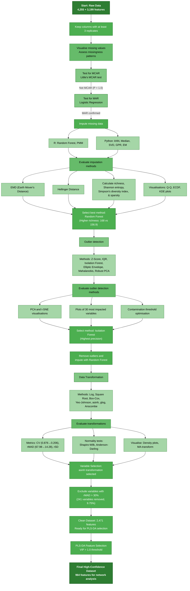

# 🌾 Conserved leaf–root metabolomic network asymmetry underpins divergent drought strategies

*Uncovering the architectural principles of drought tolerance through integrated metabolomic-network analysis*

## 🎯 Project Overview
This repository contains the analytical pipeline used to investigate how wheat plants adapt to drought stress through tissue-specific metabolic networks. Our study reveals that drought-tolerant wheat varieties maintain distinct molecular organisations in leaves versus roots - leaves show highly integrated networks optimised for rapid photosynthetic responses, whilst roots display modular networks suited for localised environmental adaptation. These architectural differences help explain how some wheat varieties better withstand drought conditions.

### Key Discoveries
Using well-characterised contrasting wheat genotypes **G1 (Gladius, drought-tolerant)** and **G2 (DAS5_003811, drought-susceptible)**, we identified:

- **Fundamental tissue-specific network asymmetry**: Leaves maintain ~40% denser networks (0.354 vs 0.192) with elevated transitivity, whilst roots deploy fragmented, modular architectures
- **Strategic temporal decoupling**: Initial strong cross-tissue coordination (r ≈ 0.546) transitions to strategic independence (r ≈ 0.350) under prolonged stress
- **Biphasic adaptation strategy**: Coordinated initial responses followed by tissue-specific specialisation, unique to drought-tolerant genotypes
- **Rigorous statistical robustness**: All findings confirmed through Bayesian sensitivity analysis (P < 0.001 across all constraint levels) and permutation testing

### Workflow Overview


### Core Capabilities
- Analysis of 2,471 molecular features across tissues and genotypes
- PLS-DA feature selection (VIP > 1) identifying 964 high-confidence features
- Comprehensive robustness framework (permutation + bootstrap + Bayesian sensitivity analysis)
- Advanced network topology analysis with hub distribution assessment
- Temporal dynamics evaluation with strategic decoupling quantification
- Multi-genotype comparative analysis framework

## 🔑 Keywords
`metabolomics` `network-analysis` `drought-tolerance` `wheat` `systems-biology` `temporal-dynamics` `tissue-specific-metabolism` `LC-MS` `bioinformatics` `plant-science` `osmotic-stress` `metabolic-networks` `Bayesian-networks`

## 🏗️ System Architecture

### Analysis Pipeline Structure
```
📦 Metabolomics-Analysis-Pipeline
 ├── 📂 data                          
 ├── 📂 src                           
 │   ├── 📂 1_data_preprocessing          # Core preprocessing pipeline
 │   │   │
 │   │   ├── 📄 feature_filter.py         # Step 1: Initial feature filtering
 │   │   │
 │   │   ├── 📄 missing_vis.py            # Step 2a: Missing value visualisation
 │   │   ├── 📄 mcar_test.py              # Step 2b: MCAR test
 │   │   ├── 📄 mar_test.py               # Step 2c: MAR test  
 │   │   ├── 📄 logistic_test_analysis.py        # Step 2d: Logistic regression (MAR analysis)
 │   │   ├── 📄 logistic_test_visualization.py   # Step 2e: Logistic results visualization
 │   │   │
 │   │   ├── 📄 median_impute.py          # Step 3a: Median imputation
 │   │   ├── 📄 rf_impute.R               # Step 3b: Random Forest imputation
 │   │   ├── 📄 ml_impute.py              # Step 3c: ML-based imputation
 │   │   ├── 📄 impute_validate.py        # Step 3d: Imputation validation
 │   │   ├── 📄 impute_dist_check.py      # Step 3e: Post-imputation distribution check
 │   │   ├── 📄 diversity_metrics.py      # Step 3f: Imputation quality metrics
 │   │   │
 │   │   ├── 📄 isolation_forest.py       # Step 4a: Outlier detection
 │   │   ├── 📄 dim_reduce_outliers.py    # Step 4b: Dimensionality reduction outlier detection
 │   │   ├── 📄 outlier_vis.py            # Step 4c: Outlier visualisation
 │   │   │
 │   │   ├── 📄 transform_data.py         # Step 5a: Apply transformations
 │   │   ├── 📄 normality_test.py         # Step 5b: Normality testing
 │   │   ├── 📄 normality_vis.py          # Step 5c: Normality visualisation
 │   │   ├── 📄 transform_eval.py         # Step 5d: Transformation evaluation (violin plots)
 │   │   ├── 📄 transform_eval_facet.py   # Step 5e: Transformation evaluation (facet grids)
 │   │   ├── 📄 transform_metrics.py      # Step 5f: Comprehensive transformation metrics
 │   │   │
 │   │   ├── 📄 variance_qc.py            # Step 6a: Variance quality control
 │   │   └── 📄 variance_filter.py        # Step 6b: High-variance feature removal
 │   │
 │   ├── 📂 2_wheat_analysis          # Wheat metabolomic network analysis
 │   │   ├── 📄 ini_analysis.py          # Final preprocessing
 │   │   ├── 📄 ini_analysis_summary.py  # Preprocessing summary
 │   │   ├── 📄 stat_tests.py            # Statistical tests
 │   │   ├── 📄 pls_tissue.py            # PLS analysis by tissue
 │   │   ├── 📄 spearman_network.py      # Spearman correlation network
 │   │   ├── 📄 network_decay.py         # Network decay analysis
 │   │   ├── 📄 network_summary.py       # Network summary
 │   │   ├── 📄 baysian_network.R        # Bayesian network analysis
 │   │   ├── 📄 bayesian_sensitivity.R   # Parent-constraint sensitivity analysis (unconstrained / maxp=5 / maxp=3)
 │   │   ├── 📄 bootstrap_stability.py   # Cluster bootstrap + jackknife metric stability
 │   │   ├── 📄 anova_concordance.py     # ANOVA / non-parametric concordance check
 │   │   ├── 📄 network_robustness.py    # Threshold & VIP sensitivity sweep
 │   │   ├── 📄 tissue_analysis.R        # Tissue-specific analysis
 │   │   └── 📄 tissue_summary.R         # Tissue analysis summary
 │   │
 │   ├── 📂 3_arabidopsis_analysis    # Cross-species confirmation (Arabidopsis)
 │   │   ├── 📄 athal_validate.py        # Network confirmation analysis (main)
 │   │   ├── 📄 athal_effects.py         # Effect size calculation & Fig 5 generation
 │   │   ├── 📄 athal_explore.py         # Data exploration (supplementary)
 │   │   └── 📄 athal_load.py            # Metabolite data loading (supplementary)
 │   │
 │   ├── 📂 4_visualisation            # Figure generation scripts
 │   │   ├── 📂 main                  # Main figure scripts
 │   │   │   ├── 📂 figure1               # Tissue-specific network architecture
 │   │   │   │   ├── 📄 network_vis_redesign_v3.py  # Network visualisation (panels A-B)
 │   │   │   │   ├── 📄 radar_plot.R         # Radar plot (panel C)
 │   │   │   │   ├── 📄 bayesian_crosstalk.R # Bayesian network analysis (panel D)
 │   │   │   │   ├── 📄 hub_dist.R           # Hub distribution (panel E)
 │   │   │   │   ├── 📄 hub_decay.R          # Hub decay (panel F)
 │   │   │   │   ├── 📄 module_org.R         # Module organisation (panel G)
 │   │   │   │   ├── 📄 module_stability.R   # Module stability (panel H)
 │   │   │   │   └── 📄 temporal_stability.R # Temporal stability (panel I)
 │   │   │   │
 │   │   │   ├── 📂 figure2               # Temporal dynamics and cross-tissue coordination
 │   │   │   │   ├── 📄 fig_2_a_b_c_v2.R     # Temporal coordination & hub overlap (panels A-C)
 │   │   │   │   └── 📄 fig_2_d_e.R          # Effect size distributions & response ratios (panels D-E)
 │   │   │   │
 │   │   │   ├── 📂 figure3               # Network mechanisms and feature dynamics
 │   │   │   │   └── 📄 fig_3_v3_redesigned_v2.R    # Complete figure 3 generation
 │   │   │   │
 │   │   │   ├── 📂 figure4               # Multi-level robustness analysis (wheat)
 │   │   │   │   └── 📄 validation_vis.R     # Wheat network robustness visualisation
 │   │   │   │
 │   │   │   └── 📂 figure5               # Cross-species confirmation (Arabidopsis)
 │   │   │       └── 📄 fig_5.py             # Arabidopsis confirmation figure
 │   │   │
 │   │   └── 📂 sup                   # Supplementary figure scripts
 │   │
 │   └── 📂 5_chemical_identification # Chemical annotation and classification
 │       ├── 📄 hmdb_annotate.py         # HMDB database annotation
 │       ├── 📄 gnps_annotate.py         # GNPS molecular networking annotation
 │       ├── 📄 struct_classify.py       # Structural classification
 │       └── 📄 func_group.py            # Functional group analysis
 │
 ├── 📂 fig_png                        # Figures .png files
 ├── 📂 3D_figures                     # Interactive 3D visualisations
 ├── 📄 requirements.txt               # Python dependencies
 ├── 📄 environment.yaml               # Conda environment configuration 
 └── 📄 README.md                      # Project overview and documentation

```

## 📊 Key Findings

### Network Architecture Comparison
| Network Property | Leaves (G1) | Roots (G1) | Biological Significance |
|-----------------|-------------|------------|------------------------|
| **Network Density** | 0.354 | 0.192 | Higher leaf density enables rapid stress response coordination |
| **Transitivity** | 0.740-0.804 | 0.686-0.714 | Better leaf network clustering for photosynthetic adaptation |
| **Modularity** | 0.097-0.162 | 0.213-0.288 | Root networks more compartmentalised for localised responses |
| **Components** | 6 | 18-21 | Roots show more independent functional modules |
| **Hub Connectivity** | 872 connections | 767 connections | Concentrated leaf hubs vs distributed root organisation |

### Temporal Dynamics Discovery
| Phase | Cross-tissue Correlation | Adaptation Strategy |
|-------|-------------------------|-------------------|
| **Initial Response** | r ≈ 0.546 | Coordinated whole-plant adjustment |
| **Prolonged Stress** | r ≈ 0.350 | Strategic tissue-specific specialisation |
| **G2 (Susceptible)** | r ≈ 0.236-0.288 | Weak, unstable coordination |

### Statistical Robustness Results
- **Bayesian Network Analysis**: P < 0.001 (non-random organisation)
- **Permutation Testing**: 5,000 iterations confirming significance
- **Effect Sizes**: Leaves = 25.87, Roots = 18.75
- **Hub Analysis**: Kruskal-Wallis H = 702.44, P = 6.20 × 10⁻¹⁵²

## 🚀 Technical Stack

### Core Analysis Pipeline
- **Data Processing**: 
  - Pandas/NumPy (data manipulation)
  - scikit-learn (PLS-DA, machine learning)
  - RDKit (chemical analysis)
  
- **Network Analysis**:
  - NetworkX (network construction and metrics)
  - igraph (community detection and modularity)
  - bnlearn (Bayesian network structure learning)

- **Statistical Robustness**:
  - Permutation testing frameworks
  - Bootstrap resampling (n=5,000)
  - Cross-validation protocols

- **Visualisation**:
  - Matplotlib/Seaborn (static plots)
  - ggplot2 (publication-quality figures)
  - Plotly (interactive 3D networks)

## 🛠️ Installation & Setup

### Quick Start

**Clone Repository**
```bash
git clone https://github.com/shoaibms/metabo-net.git
cd metabo-net
```

# 📈 Analysis Pipeline
Our metabolomics data analysis pipeline consists of four major phases, with comprehensive preprocessing steps to ensure data quality and reliability.

## Detailed Data Preprocessing Workflow


## Pipeline Overview

### 1️⃣ Enhanced Data Preprocessing
**Comprehensive Quality Control Pipeline:**
- **Missing Value Analysis**: Little's MCAR test (P = 1.0) → MAR scenario → Random Forest imputation
- **Outlier Detection**: Isolation Forest selected for highest precision across 7 methods
- **Transformation Optimisation**: asinh transformation reducing CV from 0.876 to 0.206
- **Feature Refinement**: rMAD-based filtering (>30% threshold) removing 241 highly variable features

### 2️⃣ Multi-Layer Network Analysis
Our three-layer analytical framework addresses distinct biological questions:
- **Layer 1**: Spearman correlation networks (|r| > 0.7, FDR < 0.05) - metabolite co-regulation patterns
- **Layer 2**: Topology analysis (density, transitivity, modularity, hub distribution) - architectural principles  
- **Layer 3**: Bayesian networks (Hill-climbing DAG, 5,000 bootstrap iterations) - directional dependencies and robustness confirmation

### 3️⃣ Advanced Temporal Analysis
**Tracking Dynamic Network Evolution:**
- Cross-tissue correlation progression (r = 0.546 → 0.350 in G1)
- Strategic decoupling quantification and biphasic response identification
- Module preservation analysis with standardised preservation statistics
- Pathway-level temporal coherence assessment (Kendall's W coefficient)

### 4️⃣ Rigorous Statistical Robustness Framework
**Multi-tier analysis ensuring result robustness:**
- **Bayesian Robustness**: Sensitivity analysis across parent constraints (unconstrained / maxp=5 / maxp=3), all P < 0.001
- **Permutation Testing**: 5,000 iterations with FDR correction
- **Bootstrap Analysis**: n=5,000 resamples for confidence intervals  
- **Cross-Validation**: Nested 10-fold outer, 5-fold inner for PLS-DA
- **Effect Size Quantification**: Cliff's Delta and standardised metrics

## 🏆 Research Impact & Applications
### Theoretical Contributions
1. **Network Architecture Theory**: Established complementary tissue-specific strategies (integrated vs modular)
2. **Temporal Control Mechanism**: Identified strategic decoupling as adaptive strategy
3. **Robustness Framework**: Comprehensive multi-layer approach for metabolic network analysis

## 🌍 Broader Context
This work addresses critical challenges in climate-smart agriculture by providing mechanistic insights into drought tolerance. As water stress intensifies globally, understanding how tolerant genotypes organise their molecular responses becomes increasingly vital for developing resilient crop varieties.

## 📧 Contact
For questions about the methodology or collaboration opportunities, please contact:
**Shoaib M. Mirza** – shoaibmirza2200@gmail.com

## 📜 Licence & Usage
This project is licensed under the **MIT Licence**.

---

<div align="center">

**🌾 Advancing Plant Science Through Computational Innovation 🌾**

*A collaboration between Agriculture Victoria & La Trobe University*

[](https://agriculture.vic.gov.au/)
[](https://www.latrobe.edu.au/)

*Deciphering drought tolerance through tissue-specific molecular architectures*

**Empowering climate-resilient agriculture through systems biology**

</div>
