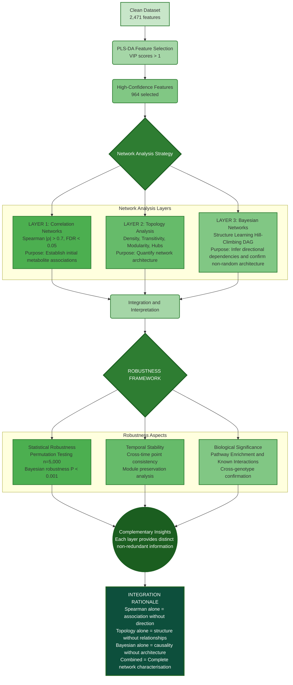
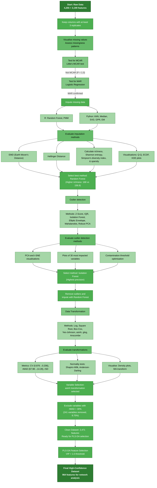

# Conserved leaf–root metabolomic network asymmetry underpins divergent drought strategies

*Code, workflows, and figure-generation scripts supporting integrated LC–MS metabolomics and network analysis of osmotic stress responses in wheat, with supportive cross-species analysis in Arabidopsis.*

## Project Overview

This repository contains the analytical pipeline used in the manuscript **"Conserved leaf–root metabolomic network asymmetry underpins divergent drought strategies."** It integrates LC–MS preprocessing, feature selection, correlation-network construction, topology analysis, robustness testing, Bayesian structure learning, temporal analysis, and figure generation.

In the primary wheat dataset, the analysis identifies a reproducible architectural asymmetry under controlled osmotic stress: leaf networks are denser and more integrated, whereas root networks are more modular and fragmented. Temporal analysis further indicates stronger early cross-tissue coordination followed by reduced coordination under prolonged stress in the drought-tolerant genotype. Bayesian structure learning is used as a complementary modelling layer that provides convergent evidence for non-random conditional-dependency structure under directed acyclic graph assumptions; it is not interpreted as causal proof.

## Scope and Interpretation

- The primary wheat analysis focuses on **two contrasting genotypes**: **G1 (Gladius; drought-tolerant)** and **G2 (DAS5_003811; drought-susceptible)**.
- All wheat experiments were performed under **controlled hydroponic osmotic stress**, which enabled tightly synchronised stress onset and rapid, low-contamination root harvest for time-resolved network reconstruction.
- The Arabidopsis component is included as **supportive cross-species evidence for scaffold detectability**, using an engineered brassinosteroid-signalling line (**35S:BRL3-GFP**), rather than as population-level confirmation of the wheat time-series analysis.
- Translation of these network-derived traits to **field drought** remains an important next step.

## Key Results

- **Tissue-specific network asymmetry:** In G1, leaves show denser and more integrated networks (density 0.354 vs. 0.192), whereas roots show stronger modularity and fragmentation.
- **Temporal reorganisation:** Cross-tissue coordination is stronger early in stress (ρ ≈ 0.546) and declines over time (ρ ≈ 0.350) in the tolerant genotype.
- **Robustness across analysis choices:** Core conclusions are preserved across threshold sensitivity analyses, VIP sensitivity analyses, bootstrap-based stability analyses, and Bayesian max-parent sensitivity analyses.
- **Scaffold detectability across systems:** The Arabidopsis analysis supports the detectability of a conserved leaf–root architectural scaffold, while indicating that allocation within that scaffold can be altered by signalling context.

### Workflow Overview


### Core Capabilities

- Analysis of **2,471 molecular features** across tissues and genotypes
- PLS-DA feature selection (**VIP > 1**) identifying **964 high-confidence features**
- Correlation-network and topology analysis across tissues and time points
- Bayesian structure learning with parent-constraint sensitivity analysis
- Temporal coordination, module preservation, and pathway-level coherence analysis
- Figure-generation scripts for main and supplementary outputs

## Keywords

`metabolomics` `network-analysis` `drought-tolerance` `wheat` `systems-biology` `temporal-dynamics` `tissue-specific-metabolism` `LC-MS` `bioinformatics` `plant-science` `osmotic-stress` `metabolic-networks` `Bayesian-networks`

## System Architecture

### Analysis Pipeline Structure
```
📦 Metabolomics-Analysis-Pipeline
 ├── 📂 data                          
 ├── 📂 src                           
 │   ├── 📂 1_data_preprocessing          # Core preprocessing pipeline
 │   │   │
 │   │   ├── 📄 feature_filter.py         # Step 1: Initial feature filtering
 │   │   │
 │   │   ├── 📄 missing_vis.py            # Step 2a: Missing value visualisation
 │   │   ├── 📄 mcar_test.py              # Step 2b: MCAR test
 │   │   ├── 📄 mar_test.py               # Step 2c: MAR test  
 │   │   ├── 📄 logistic_test_analysis.py        # Step 2d: Logistic regression (MAR analysis)
 │   │   ├── 📄 logistic_test_visualization.py   # Step 2e: Logistic results visualization
 │   │   │
 │   │   ├── 📄 median_impute.py          # Step 3a: Median imputation
 │   │   ├── 📄 rf_impute.R               # Step 3b: Random Forest imputation
 │   │   ├── 📄 ml_impute.py              # Step 3c: ML-based imputation
 │   │   ├── 📄 impute_validate.py        # Step 3d: Imputation validation
 │   │   ├── 📄 impute_dist_check.py      # Step 3e: Post-imputation distribution check
 │   │   ├── 📄 diversity_metrics.py      # Step 3f: Imputation quality metrics
 │   │   │
 │   │   ├── 📄 isolation_forest.py       # Step 4a: Outlier detection
 │   │   ├── 📄 dim_reduce_outliers.py    # Step 4b: Dimensionality reduction outlier detection
 │   │   ├── 📄 outlier_vis.py            # Step 4c: Outlier visualisation
 │   │   │
 │   │   ├── 📄 transform_data.py         # Step 5a: Apply transformations
 │   │   ├── 📄 normality_test.py         # Step 5b: Normality testing
 │   │   ├── 📄 normality_vis.py          # Step 5c: Normality visualisation
 │   │   ├── 📄 transform_eval.py         # Step 5d: Transformation evaluation (violin plots)
 │   │   ├── 📄 transform_eval_facet.py   # Step 5e: Transformation evaluation (facet grids)
 │   │   ├── 📄 transform_metrics.py      # Step 5f: Comprehensive transformation metrics
 │   │   │
 │   │   ├── 📄 variance_qc.py            # Step 6a: Variance quality control
 │   │   └── 📄 variance_filter.py        # Step 6b: High-variance feature removal
 │   │
 │   ├── 📂 2_wheat_analysis          # Wheat metabolomic network analysis
 │   │   ├── 📄 ini_analysis.py          # Final preprocessing
 │   │   ├── 📄 ini_analysis_summary.py  # Preprocessing summary
 │   │   ├── 📄 stat_tests.py            # Statistical tests
 │   │   ├── 📄 pls_tissue.py            # PLS analysis by tissue
 │   │   ├── 📄 spearman_network.py      # Spearman correlation network
 │   │   ├── 📄 network_decay.py         # Network decay analysis
 │   │   ├── 📄 network_summary.py       # Network summary
 │   │   ├── 📄 baysian_network.R        # Bayesian network analysis
 │   │   ├── 📄 bayesian_sensitivity.R   # Parent-constraint sensitivity analysis (unconstrained / maxp=5 / maxp=3)
 │   │   ├── 📄 bootstrap_stability.py   # Cluster bootstrap + jackknife metric stability
 │   │   ├── 📄 anova_concordance.py     # ANOVA / non-parametric concordance check
 │   │   ├── 📄 network_robustness.py    # Threshold & VIP sensitivity sweep
 │   │   ├── 📄 tissue_analysis.R        # Tissue-specific analysis
 │   │   └── 📄 tissue_summary.R         # Tissue analysis summary
 │   │
 │   ├── 📂 3_arabidopsis_analysis    # Cross-species confirmation (Arabidopsis)
 │   │   ├── 📄 athal_validate.py        # Network confirmation analysis (main)
 │   │   ├── 📄 athal_effects.py         # Effect size calculation & Fig 5 generation
 │   │   ├── 📄 athal_explore.py         # Data exploration (supplementary)
 │   │   └── 📄 athal_load.py            # Metabolite data loading (supplementary)
 │   │
 │   ├── 📂 4_visualisation            # Figure generation scripts
 │   │   ├── 📂 main                  # Main figure scripts
 │   │   │   ├── 📂 figure1               # Tissue-specific network architecture
 │   │   │   │   ├── 📄 network_vis_redesign_v3.py  # Network visualisation (panels A-B)
 │   │   │   │   ├── 📄 radar_plot.R         # Radar plot (panel C)
 │   │   │   │   ├── 📄 bayesian_crosstalk.R # Bayesian network analysis (panel D)
 │   │   │   │   ├── 📄 hub_dist.R           # Hub distribution (panel E)
 │   │   │   │   ├── 📄 hub_decay.R          # Hub decay (panel F)
 │   │   │   │   ├── 📄 module_org.R         # Module organisation (panel G)
 │   │   │   │   ├── 📄 module_stability.R   # Module stability (panel H)
 │   │   │   │   └── 📄 temporal_stability.R # Temporal stability (panel I)
 │   │   │   │
 │   │   │   ├── 📂 figure2               # Temporal dynamics and cross-tissue coordination
 │   │   │   │   ├── 📄 fig_2_a_b_c_v2.R     # Temporal coordination & hub overlap (panels A-C)
 │   │   │   │   └── 📄 fig_2_d_e.R          # Effect size distributions & response ratios (panels D-E)
 │   │   │   │
 │   │   │   ├── 📂 figure3               # Network mechanisms and feature dynamics
 │   │   │   │   └── 📄 fig_3_v3_redesigned_v2.R    # Complete figure 3 generation
 │   │   │   │
 │   │   │   ├── 📂 figure4               # Multi-level robustness analysis (wheat)
 │   │   │   │   └── 📄 validation_vis.R     # Wheat network robustness visualisation
 │   │   │   │
 │   │   │   └── 📂 figure5               # Cross-species confirmation (Arabidopsis)
 │   │   │       └── 📄 fig_5.py             # Arabidopsis confirmation figure
 │   │   │
 │   │   └── 📂 sup                   # Supplementary figure scripts
 │   │
 │   └── 📂 5_chemical_identification # Chemical annotation and classification
 │       ├── 📄 hmdb_annotate.py         # HMDB database annotation
 │       ├── 📄 gnps_annotate.py         # GNPS molecular networking annotation
 │       ├── 📄 struct_classify.py       # Structural classification
 │       └── 📄 func_group.py            # Functional group analysis
 │
 ├── 📂 fig_png                        # Figures .png files
 ├── 📂 3D_figures                     # Interactive 3D visualisations
 ├── 📄 requirements.txt               # Python dependencies
 ├── 📄 environment.yaml               # Conda environment configuration 
 └── 📄 README.md                      # Project overview and documentation

```

## Key Findings

### Network Architecture Comparison

| Network Property | Leaves (G1) | Roots (G1) | Interpretation |
|------------------|-------------|------------|----------------|
| **Network Density** | 0.354 | 0.192 | Higher leaf density is consistent with stronger global integration |
| **Transitivity** | 0.740–0.804 | 0.686–0.714 | Leaves show stronger clustering of metabolite relationships |
| **Modularity** | 0.097–0.162 | 0.213–0.288 | Roots show stronger compartmentalisation into modules |
| **Components** | 6 | 18–21 | Roots contain more disconnected subnetworks |
| **Hub Connectivity** | Concentrated in fewer high-degree hubs | Distributed across more nodes | Leaves favour concentrated integration; roots favour broader distribution |

### Temporal Dynamics

| Phase | Cross-tissue Correlation | Interpretation |
|-------|--------------------------|----------------|
| **Initial response (G1)** | ρ ≈ 0.546 | Stronger leaf–root coordination early in stress |
| **Prolonged stress (G1)** | ρ ≈ 0.350 | Reduced coordination with stronger tissue specialisation |
| **G2 (susceptible)** | ρ = 0.236–0.288 | Weaker and less stable cross-tissue coordination |

### Robustness Summary

- **Bayesian structure learning:** observed arc counts remain far above the permuted-data null under unconstrained, `maxp = 5`, and `maxp = 3` analyses (**P < 0.001** throughout).
- **Constraint sensitivity:** constrained Bayesian networks preserve the leaf–root ordering and retain **88.6–92.7%** overlap with the unconstrained scaffold.
- **Permutation testing:** network and effect-size analyses were benchmarked with permutation-based inference and FDR control.
- **Bootstrap-based analyses:** confidence intervals and stability assessments were computed for key summaries.
- **Threshold and feature-selection sensitivity:** core architectural conclusions were stable to reasonable changes in correlation thresholds and VIP cut-offs.

## Technical Stack

### Core Analysis Components

- **Data processing**
  - Pandas / NumPy
  - scikit-learn
  - RDKit

- **Network analysis**
  - NetworkX
  - igraph
  - bnlearn

- **Statistical analysis**
  - Non-parametric testing
  - Permutation frameworks
  - Bootstrap resampling
  - Cross-validation

- **Visualisation**
  - Matplotlib / Seaborn
  - ggplot2
  - Plotly

## Installation and Setup

### Quick Start

```bash
git clone https://github.com/shoaibms/metabo-net.git
cd metabo-net
```

Create the analysis environment using either:

```bash
conda env create -f environment.yaml
```

or

```bash
pip install -r requirements.txt
```

## Analysis Pipeline

Our metabolomics data analysis pipeline consists of four major phases, with comprehensive preprocessing steps to ensure data quality and reliability.

## Detailed Data Preprocessing Workflow


## Pipeline Overview

### 1. Enhanced Data Preprocessing

**Comprehensive quality-control workflow:**

- Missingness was assessed statistically (Little's MCAR test, P = 1.0; MAR confirmed) and handled using a dedicated imputation-selection workflow.
- Random Forest imputation was selected after comparison with six alternative methods (higher richness: 168 vs. 156.9).
- Isolation Forest was selected as the preferred outlier-detection method after evaluation across seven approaches.
- asinh transformation reduced overall variability (CV: 0.876 → 0.206) before downstream network analysis.
- 241 high-variability features were removed using an rMAD-based filtering step (>30% threshold; 9.75% of features).

### 2. Multi-layer Network Analysis

This repository implements a three-layer analytical framework, with each layer addressing a different question:

- **Layer 1:** Spearman correlation networks (`|ρ| > 0.7`, `FDR < 0.05`) to capture pairwise co-abundance associations.
- **Layer 2:** Topology analysis (density, transitivity, modularity, components, hub distribution) to quantify architectural organisation.
- **Layer 3:** Bayesian structure learning (hill-climbing DAG with bootstrap-based arc stability and parent-constraint sensitivity analysis) to characterise conditional-dependency structure under complementary modelling assumptions.

### 3. Temporal Analysis

- Cross-tissue correlation trajectories across time points
- Strategic decoupling analysis in the tolerant genotype
- Module preservation analysis with standardised preservation statistics
- Pathway-level temporal coherence assessment (Kendall's W coefficient)

### 4. Robustness and Sensitivity Framework

- Bayesian max-parent sensitivity analysis (`unconstrained`, `maxp = 5`, `maxp = 3`)
- Permutation-based inference with multiple-testing control (5,000 iterations, FDR correction)
- Bootstrap-based confidence intervals and stability analyses
- Cross-validation for feature-selection workflows (nested 10-fold outer, 5-fold inner)
- Effect-size estimation using Cliff's delta and standardised metrics

## Reproducibility

- Environment specifications are provided in `environment.yaml` and `requirements.txt`.
- The repository includes scripts for preprocessing, network reconstruction, robustness analyses, and figure generation.
- All stochastic steps should be run with fixed seeds and a recorded software environment for release-ready reproducibility.

## Data Availability

The processed metabolomics data, analysis scripts, and figures generated during this study are publicly available in this GitHub repository. Raw LC–MS data and processed datasets are intended for deposition in **MetaboLights** and **Zenodo**, respectively, upon acceptance of the associated manuscript.

## Citation

If you use this repository, please cite the associated manuscript and the archived repository release.

**Associated manuscript:**  
*Conserved leaf–root metabolomic network asymmetry underpins divergent drought strategies.*

*A formal journal citation and DOI will be added upon acceptance.*

## Contact

For repository-specific questions, please open an issue in this repository or contact the corresponding author associated with the manuscript.

**Shoaib M. Mirza** – shoaibmirza2200@gmail.com

## License

This project is released under the **MIT License**.

---

<div align="center">

*A collaboration between Agriculture Victoria & La Trobe University*

[](https://agriculture.vic.gov.au/)
[](https://www.latrobe.edu.au/)

</div>
